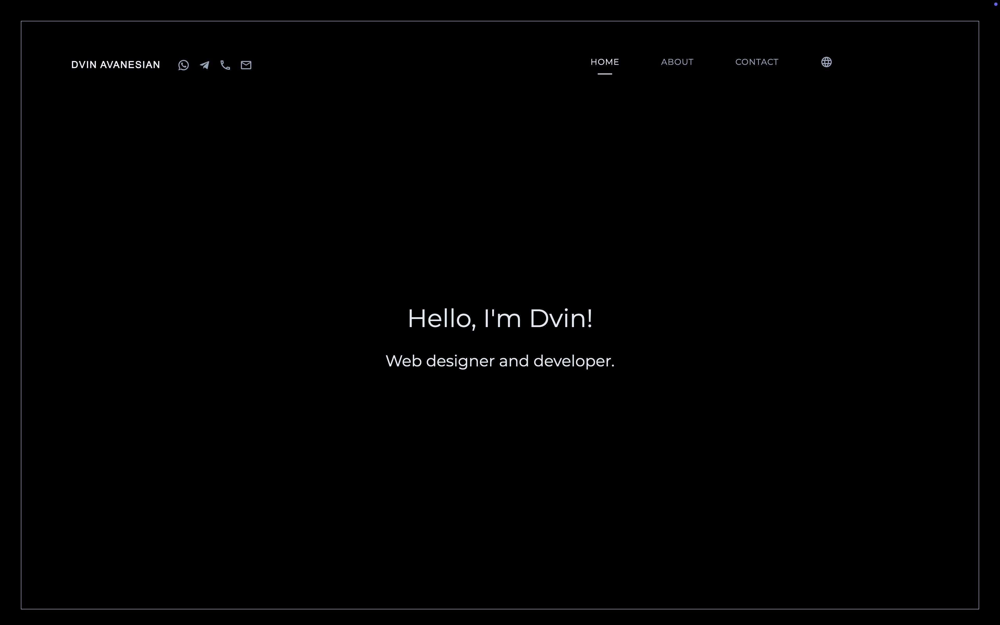

# DvinDev

This project started as my personal website, but I lost interest and stopped maintaining it. Then, after two years, I checked back and realized it’s way cooler than I gave it credit for, so now I’m sharing it.
Feel free to explore, learn, and steal ideas for your own shit.



## Getting Started

### Install dependencies

```bash
npm install
```

### Run in development mode

```bash
npm run dev
```

Open http://localhost:3000 to view the site.

### Build for production

```bash
npm run build
```

### Start the production server

```bash
npm start
```

## License

WTFPL — see [LICENSE](LICENSE) for details.
